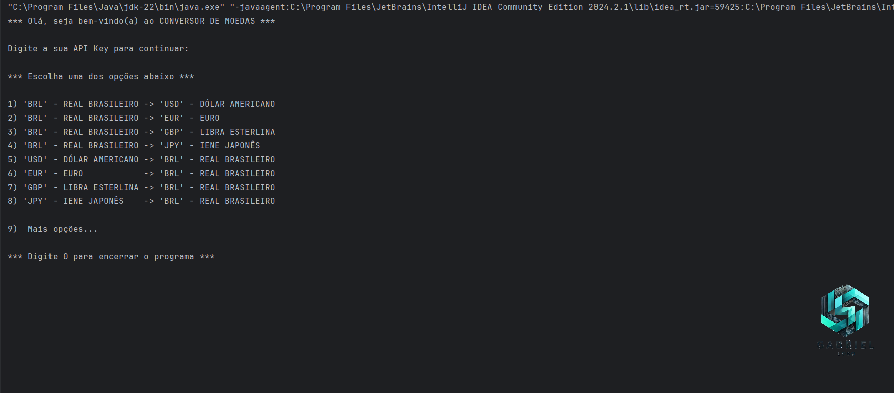

# Conversor de Moedas

O Conversor de Moedas é um desáfio de projeto proposto pela [alura](https://cursos.alura.com.br) como requisito obrigatório da trilha de formação em _Desenvolvedor back end JAVA + Spring_ do
programa [ONE - Oracle Next Education](https://www.oracle.com/br/education/oracle-next-education/). O projeto consiste em uma aplicação na linguagem JAVA, onde o usuário pode realizar conversões de moedas,
como exemplo "BRL" para "USD".

## 🔨 Funcionalidades do projeto
O `Conversor de Moedas` conta com `162 opções` de conversão de moedas, atualizadas em `tempo real`, além de ter 8 opções de conversão já prontas. Para utilizar, basta somente informar a `moeda de origem`,
em seguida a `moeda de destino`, e por fim o `valor` que deseja converter, em poucos segundos
o sistema vai lhe retornar o `resultado` da seguinte forma.

<code>
**************************************************
    CONVERTENDO O VALOR DE: 10.0 EM BRL
    CORRESPONDE AO VALOR DE: 1.77 EM USD
**************************************************
</code>

## 📝 Técnicas e tecnologias utilizadas

- Consumo de `API` (Java.net)
- `Listas` e `Coleções`
- `POO`
- `Json` utilizando o Gson

 

 

> Fique a vontade para deixar o seu feedback sobre boas práticas, ou como você teria feito!